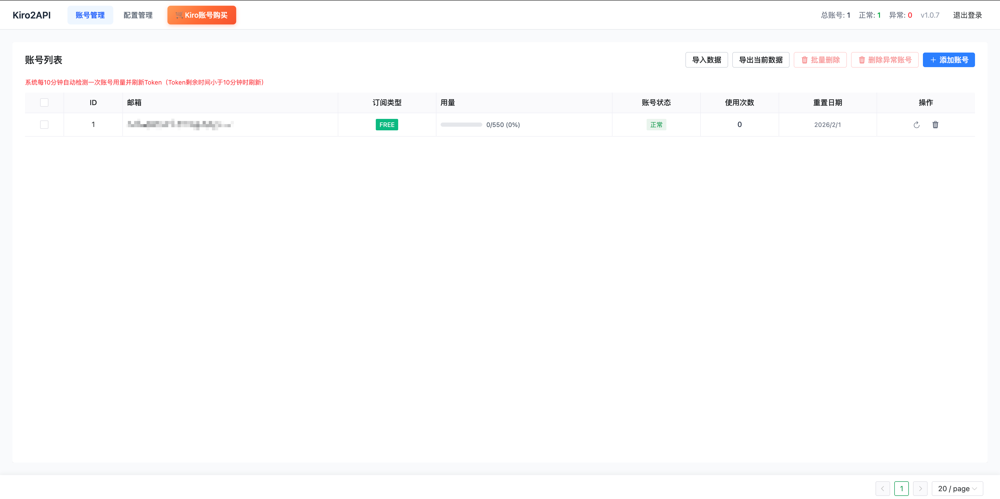

# Kiro2API 部署指南

## 项目展示



## 快速开始

### 1. 下载部署文件

```bash
git clone https://github.com/ssmdo/kiro2api.git
cd kiro2api/
```

### 2. 一键部署

```bash
chmod +x deploy.sh
./deploy.sh
```

运行 `./deploy.sh` 会自动执行：停止旧服务 → 拉取最新镜像 → 启动服务

### 3. 常用命令

```bash
# 查看日志
docker compose logs -f

# 停止服务
docker compose down

# 查看状态
docker compose ps
```

## 配置说明

### .env 文件

```bash
# Docker 镜像配置
DOCKER_IMAGE=ssmdo/kiro2api:latest

# 服务端口
PORT=8000
```

### config.yaml 文件

```yaml
server:
  address: ":8000"  # 服务监听地址

database:
  default:
    type: "sqlite"
    link: "sqlite:./data/kiro.db"  # 数据库路径

kiro:
  apiTarget: "https://q.us-east-1.amazonaws.com"
  authTarget: "https://prod.us-east-1.auth.desktop.kiro.dev"
  version: "0.8.0"
```

## 目录结构

```
deploy/
├── README.md           # 部署说明
├── deploy.sh           # 一键部署脚本
├── docker-compose.yml  # Docker Compose 配置
├── config.yaml         # 应用配置文件
├── .env.example        # 环境变量示例
└── data/               # 数据目录（自动创建）
    └── kiro.db         # SQLite 数据库
```

## 常见问题

### 1. 端口被占用

修改 `.env` 文件中的 `PORT` 变量：

```bash
PORT=8080
```

### 2. 更新到最新版本

直接重新运行部署脚本即可：

```bash
./deploy.sh
```

### 3. 查看运行日志

```bash
docker compose logs -f
```

### 4. 数据持久化

数据存储在 `./data` 目录中，包括 SQLite 数据库文件。备份时请备份此目录。

## License

MIT License